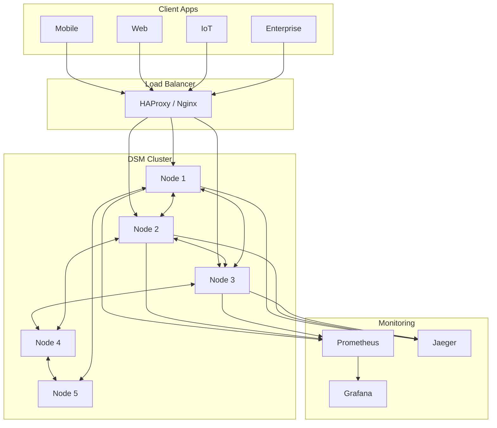

# DSM Storage Node 🌐

[](https://www.rust-lang.org/)
[](LICENSE)
[](https://github.com/dsm-project/dsm-storage-node)
[](https://en.wikipedia.org/wiki/Post-quantum_cryptography)
[](docs/)

> **Quantum-resistant decentralized storage node** for the Decentralized State Machine (DSM) network. Enables secure, distributed storage operations with multi-party computation (MPC) for trustless identity creation and blind device ID generation.

---

## 📋 Table of Contents

- [Overview](#-overview)
- [Key Features](#-key-features)
- [Architecture](#️-architecture)
- [Quick Start](#-quick-start)
- [Installation](#-installation)
- [Configuration](#️-configuration)
- [API Reference](#-api-reference)
- [Deployment](#-deployment)
- [Security](#-security)
- [Performance & Scaling](#-performance--scaling)
- [Monitoring & Operations](#-monitoring--operations)
- [Development](#-development)
- [Troubleshooting](#-troubleshooting)
- [Contributing](#-contributing)
- [License](#-license)

---

## 🌟 Overview

DSM Storage Node is a **quantum-resistant, decentralized storage system** designed for secure, distributed storage with **multi-party computation (MPC)** capabilities and high-availability clustering. It is production-grade and ready for demanding environments.

### What Makes DSM Storage Node Unique

- 🔐 **Quantum-Resistant Security:** Kyber, SPHINCS+, Dilithium (post-quantum cryptography)
- 🤝 **Trustless Identity Generation:** No central authority, no single point of failure
- 📱 **Blind Device ID Creation:** Zero-trust device authentication for IoT/mobile/edge
- 🌊 **Epidemic Storage Protocol:** Gossip-based distributed storage, auto-replication
- ⚡ **High Performance:** Sub-millisecond local latency, high-throughput network
- 🏗️ **Production Ready:** Real monitoring, health checks, admin tooling

### Typical Use Cases

- Secure device registration and authentication (IoT, mobile)
- Web3/dApp backend and wallet state storage
- Quantum-resistant enterprise data storage
- Blockchain state persistence
- Distributed edge or hybrid cloud compute environments

---

## ✨ Key Features

### 🔐 Security & Cryptography
- **Post-Quantum Crypto:** Kyber KEM, SPHINCS+ signatures, Dilithium
- **MPC:** Threshold multi-party key generation
- **Blind Encryption:** End-to-end, zero-knowledge
- **Blake3 Hashing:** Quantum-resistant hashing for all proofs
- **AES-256-GCM:** Standardized strong encryption with PQ key exchange

### 🌐 Distributed Storage
- **Epidemic Protocol:** Gossip/eventual consistency
- **Pluggable Backends:** SQLite, in-memory, epidemic, distributed
- **Geo Distribution:** Region-aware data placement
- **Load Balancing:** Node-aware request routing
- **Auto-Replication:** Configurable redundancy by region/fault domain

### 📡 Network & Communication
- **RESTful API:** HTTP/JSON, OpenAPI
- **Peer Discovery:** Self-organizing clusters
- **Circuit Breakers:** Fault-tolerant failover
- **Rate Limiting:** DoS resistance
- **Connection Pooling:** Network & database

### 📊 Monitoring & Operations
- **Health Checks:** Node and cluster-wide
- **Metrics:** Prometheus/OpenTelemetry export
- **Structured Logging:** Configurable sinks
- **Admin UI:** Dashboard and CLI
- **Backup & Recovery:** Automated, encrypted

### 🛠️ Developer Experience
- **Multiple SDKs:** Rust, Python, JS, Go, Java
- **Docker:** Fully containerized
- **Hot Config Reload:** No downtime
- **Automated Tests:** Unit, integration, chaos
- **OpenAPI & Docs:** Complete endpoint coverage

---

## 🏗️ Architecture

### System Diagram


Prerequisites
```
- Rust 1.70+
- Git
- SQLite 3.30+ (auto-installed for most OS)
- curl (for API testing)
```

1. Single Node (Dev)
```bash
git clone https://github.com/dsm-project/dsm-storage-node.git
cd dsm-storage-node
cargo build --release
cargo run --bin storage_node
# Now running on http://localhost:8080
```

2. Cluster (Production)

You need at least 3 nodes for MPC threshold security.
```bash
./scripts/start-cluster.sh
./scripts/health-check.sh
```

Nodes start on ports 8080-8084 (SQLite default).

3. Test Genesis ID Creation
```bash
curl -X POST http://localhost:8080/api/v1/blind/device \
  -H "Content-Type: application/json" \
  -d '{"device_id": "my_device", "threshold": 3}'
# Response: { "session_id": "...", ... }
```

---

## 📦 Installation

### Pre-built Binaries
```bash
wget https://github.com/dsm-project/dsm-storage-node/releases/latest/download/dsm-storage-node-linux-x64.tar.gz
tar -xzf dsm-storage-node-linux-x64.tar.gz
sudo mv storage_node /usr/local/bin/
storage_node --version
```

### Build from Source
```bash
curl --proto '=https' --tlsv1.2 -sSf https://sh.rustup.rs | sh
git clone https://github.com/dsm-project/dsm-storage-node.git
cd dsm-storage-node
cargo build --release
sudo cp target/release/storage_node /usr/local/bin/
```

### Docker
```bash
docker pull dsmproject/storage-node:latest
docker run -d \
  --name dsm-node \
  -p 8080:8080 \
  -v dsm-data:/data \
  dsmproject/storage-node:latest
```

### Homebrew (macOS)
```bash
brew tap dsm-project/dsm
brew install dsm-storage-node
```

---

## ⚙️ Configuration

The node can be configured by environment variables, TOML/YAML config files, or CLI. See docs/configuration.md for a full config breakdown.

---

## 🔌 API Reference

See docs/api.md or OpenAPI spec for a full endpoint list.
```
- Genesis ID/MPC: /api/v1/blind/device, /api/v1/blind/session/:session_id
- Data Storage/Retrieval: /api/v1/data/:key (POST/GET/DELETE/HEAD)
- Vaults: /api/v1/vault
- Inbox: /api/v1/inbox
- Node & Cluster Management: /api/v1/status, /api/v1/health, /api/v1/nodes
- Metrics: /api/v1/metrics
```

All endpoints require a bearer token unless configured otherwise.

---

## 🚀 Deployment
```
- Kubernetes: See docs/kubernetes.md for manifests and cluster strategy.
- AWS/GCP/Azure: See docs/cloud-deployment.md for IaC/Terraform.
- Docker Compose: See docker/docker-compose.yml for multi-node cluster setup.
```

---

## 🔒 Security
```
- Post-Quantum Crypto: Kyber KEM, SPHINCS+, Dilithium
- MPC: Threshold cryptography, verifiable blind MPC, session isolation
- End-to-End Encryption: AES-256-GCM, ChaCha20-Poly1305
- Transport Layer: TLS 1.3, mutual TLS, strict cipher suites
- API Security: Bearer tokens, rate limiting, RBAC, audit logging
- Data at Rest: Encrypted by default
- Backup Encryption: Encrypted, signed, and compressed
- Intrusion Detection: fail2ban, audit trails
- Vulnerability Scanning: Trivy, nmap, ZAP
```

---

## ⚡ Performance & Scaling
```
- Latency: <1ms (memory), <5ms (SQLite)
- Throughput: 10,000+ req/s (single node), 50,000+ (5-node cluster)
- Scaling: Just add nodes; geo-replication by config
- Auto-Scaling: HorizontalPodAutoscaler/K8s supported
- Resource Tuning: Worker threads, memory pool, WAL/batch sizes
```

---

## 📊 Monitoring & Operations
```
- Prometheus Metrics: /api/v1/metrics
- Grafana Dashboards: See sample dashboards in monitoring/grafana/
- Log Aggregation: ELK stack, Filebeat, syslog
- Backup/Recovery: Scripts in /scripts/backup.sh and /scripts/restore.sh
- Health Checks: /api/v1/health, plus bash/Nagios scripts
- Alerting: Prometheus, Nagios/Icinga, custom rules
```

---

## 🛠️ Development

### Development Environment
```bash
curl --proto '=https' --tlsv1.2 -sSf https://sh.rustup.rs | sh
rustup component add clippy rustfmt rust-src
cargo install cargo-edit cargo-audit cargo-outdated cargo-tree
cargo install --locked just
cargo install sqlx-cli --no-default-features --features sqlite
git clone https://github.com/dsm-project/dsm-storage-node.git
cd dsm-storage-node
cargo build
cargo test
```

### Project Structure
```
dsm-storage-node/
├── src/
│   ├── api/                  # HTTP API (handlers, middleware, MPC, vault)
│   ├── crypto/               # Kyber, SPHINCS+, BLAKE3
│   ├── distribution/         # Distributed storage/sharding
│   ├── encryption/           # Blind/quantum-resistant encryption
│   ├── identity/             # Identity/MPC
│   ├── network/              # P2P
│   ├── node_management/      # Node lifecycle/health
│   ├── policy/               # Token policy mgmt
│   ├── staking/              # Node staking logic
│   ├── storage/              # Storage backends (memory/sqlite/epidemic)
│   ├── types/                # Shared types/structs
│   ├── error.rs              # Error types
│   ├── lib.rs                # Library entry
│   └── main.rs               # Binary entry
├── tests/                    # Integration tests
├── benches/                  # Benchmarks
├── docs/                     # Extended documentation
├── scripts/                  # Utility scripts
├── config/                   # Config examples
└── docker/                   # Container configs
```

---

## 🤝 Contributing

PRs and issues welcome!
```
1. Fork, branch, and commit to a feature branch.
2. Run tests and rustfmt.
3. Open a pull request with clear explanation.
4. See CONTRIBUTING.md for details.
```

---

## 🪪 License

MIT/Apache-2.0 dual license. See LICENSE for details.

---

## 🙏 Acknowledgments
```
- Post-Quantum cryptography by Kyber, SPHINCS+, Dilithium authors
- Rust community & Tokio async team
- OpenAPI, Prometheus, Grafana, Kubernetes
```

---

For full details, examples, and advanced configs, see the /docs/ directory.

---